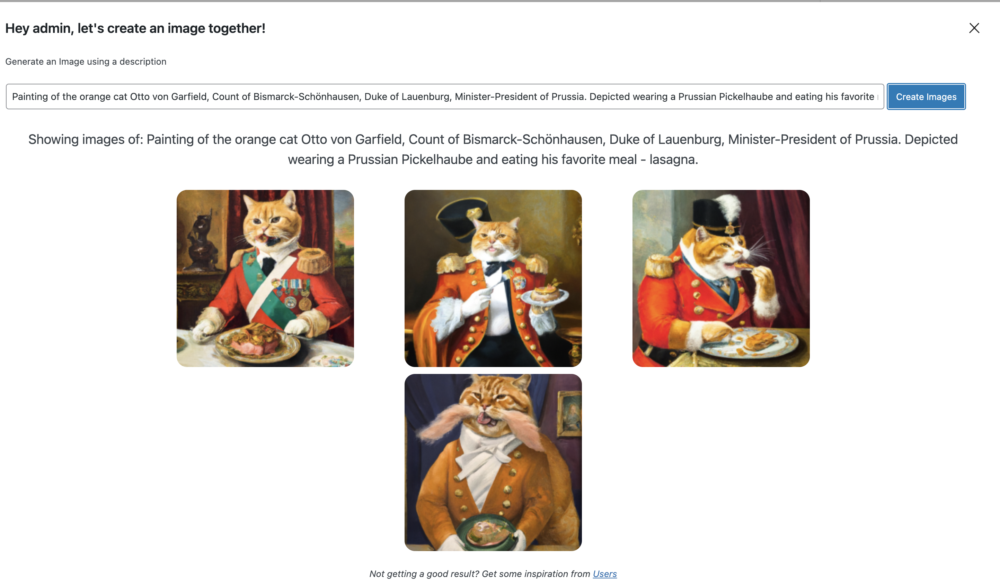

# Ayudante Model B

**Contributors:** [oscarssanchez](https://profiles.wordpress.org/oscarssanchez)

## Overview
Ayudante is a series of tools that leverage Machine Learning models, available through APIs,
to help you create better and faster content on your WordPress site.

Model B stands for "Basic" aiming provide general tools for everyone.

### Requirements

Ayudante requires the following to work:

* API Token from one AI provider **At this point only [OpenAI](https://openai.com/) is supported**
* [WordPress](http://wordpress.org) 6.0 or greater
* [PHP](https://php.net/) 7.0

## Installation

* Upload the folder to your /wp-content/plugins/ directory
* Activate the plugin through the 'Plugins' menu in WordPress
* Plugin your API Token in the plugin settings page

## Features

### Image Creation

A block that creates original images from text and uploads them to your media library.

Supported AI providers:
* [OpenAI](https://openai.com/)

### 1.0 ###

* First version
